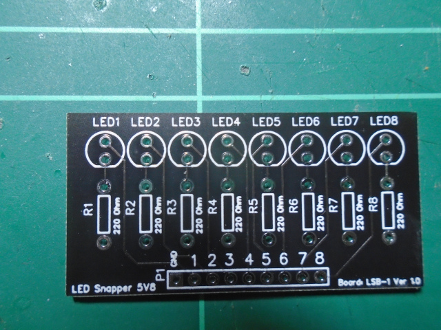
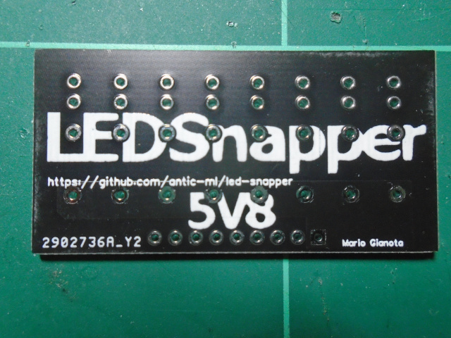
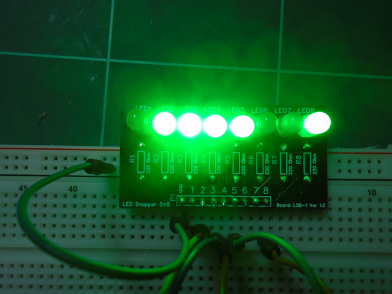
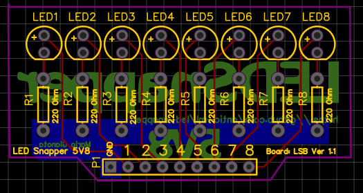
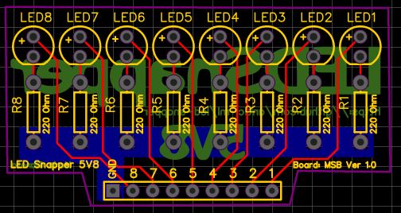

# LEDSnapper
LED Snapper is a simple, compact diagnostic board for breadboard projects. It
is particularly suitable for Arduino makers, because it is a 5 volt
module. It is cheap to make too: you can make 10 of them for around a $1.50 per board.

If you are forever plugging LEDs and resistors into breadboards to monitor
signal output from your Arduino, then you may find this board useful. It plugs
into your breadboard and there are 8 pins connected to 5 mm LEDs with
wich you can use to monitor signals. I call it LEDSnapper, beacause it 
snaps into your breadboard.

Top of the board.

Back of the board.

The board being used to test Arduino pin output.

The module is also suitable for 5 volt circuits other than the Arduino.

How To Use
----------

Connect up the GND pin and then connect one, or more of the 8 pins
connected to LEDs to +5 Volts, or the Arduino pins.

Choose from 3 different boards
------------------------------

There are 3 different versions of the board. Check the PCB layout images
below to see which one you require. Below each image you will find the
name of the associated Gerber files for that board.

Gerber File: 5V8-LSB-PCB.zip

Gerber File: 5V8-LSB-PCB-1.1.zip

Gerber File: 5V8-MSB-PCB.zip

So simple, I could make one myself!
-----------------------------------

If you are an experienced electronics hobbyist, or engineer then yes, of course
you could easily. This project is primarily designed for beginners to give them
confidence in ordering components and a PCB for manufacturing. Plus, they get
to build a simple, but useful piece of test equipment that they can use for
their breadboard projects. My hope is that beginners will build LEDSnapper and
then have the confidence to move on to more complex open source hardware and
build that too.

