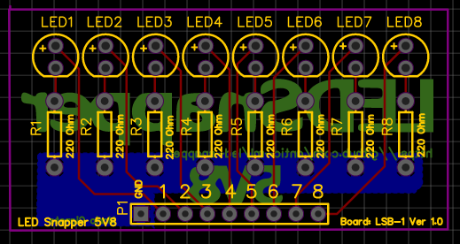

# LEDSnapper
LED Snapper is a simple, compact debugging tool for Arduino breadboard projects. It
is suitable for Arduino makers, because it is a 5 volt
module. 

If you are forever plugging LEDs and resistors into breadboards to monitor
signal output from your Arduino, then you may find this board useful. It plugs
into your breadboard and there are 8 pins connected to 5 mm LEDs 
which you can use to monitor signals. I call it **LEDSnapper**, because it 
snaps into your breadboard.

Don't buy it, **build it!** is my motto. It is cheap to make: you can make 10 of 
them for around $1.50 per board. Less, if you shop around.

Photo of the board being used to test Arduino pin output. The
board is small. It measures only 5 cm x 2.5 cm and has header pins that
plug into your breadboard.

Top of the board.

Back of the board. 5V8 means it is a 5 volt module with 8 pins.

The module is also suitable for 5 volt circuits other than the Arduino.

Component List
---------------
- 8 x 5 mm LED in the color of your choice
- 8 x 220 Ohm resistors
- Male pin headers

How To Build It
---------------
The board is marked up with the components, so you should have little difficulty
soldering them.

You'll need a soldering iron to fix the components to the board. Begin by soldering the resistors 
(220 Ohms each) first. Then solder the header pins. Next, insert LEDs of the colour of your choice 
and solder each in turn. The positive anode (the long leg) of the LED goes in the top hole on the PCB and the 
negative cathode (the short leg) goes in the bottom hole next to the resistor.

That's it! It should take you about twenty minutes, or so to solder the components onto the board. 

How To Use
----------

Connect up the GND pin and then connect one, or more of the 8 pins
connected to LEDs to +5 Volts, or the Arduino pins. The LEDs will light
up when they get a **high signal** from an Arduino pin. _Don't supply more
than 5 volts to the pins, or you may burn out the LEDs._

Choose from 3 different boards
------------------------------

There are 3 different versions of the board. Check the PCB layout images
below to see which one you require. Below each image you will find the
name of the associated Gerber files for that board. The board used in
the photos above is board #1.

Board #1: Pin numbers run left to right.
**Gerber Files:** 5V8-LSB-PCB.zip

Board #2: Pin numbers run left to right but this board occupies slightly less real estate on your breadboard.
**Gerber Files:** 5V8-LSB-PCB-1.1.zip

Board #3: Pin numbers run in reverse order from left to right. Useful for reading binary numbers.
**Gerber Files:** 5V8-MSB-PCB.zip

Getting the PCB manufactured
----------------------------

A number of companies exist that will allow you to upload Gerber files
to their website and they will manufacture the boards for you. Some, like
[JLCPCB](https://jlcpcb.com/) and [PCBWAY](https://pcbway.com/) will make the boards at a very low cost
and give you ten of them. Expect to pay around $2 for ten boards + shipping. These
companies are about the cheapest I have found, but feel free to
shop around.

So simple, I could make one myself!
-----------------------------------

If you are an experienced electronics hobbyist, or engineer then yes, of course
you could easily. This project is primarily designed for beginners to give them
confidence in ordering components and a PCB for manufacturing. Plus, they get
to build a simple, but useful piece of test equipment that they can use for
their breadboard projects. 

My hope is that people will build LEDSnapper and
then have the confidence to move on to more complex open source hardware and
build that too. Maybe this project will provide someone with the impetus to
kickstart an open source hardware project of their own.

